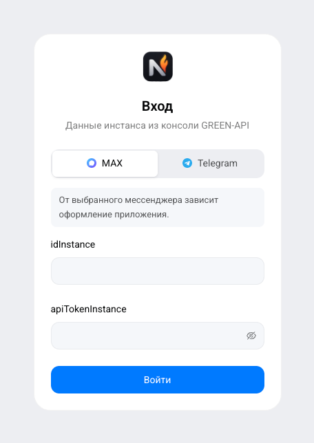
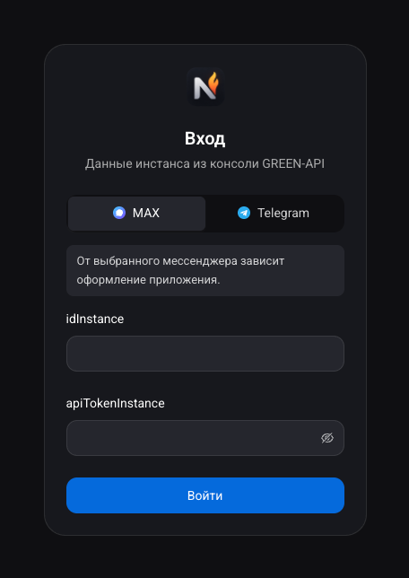
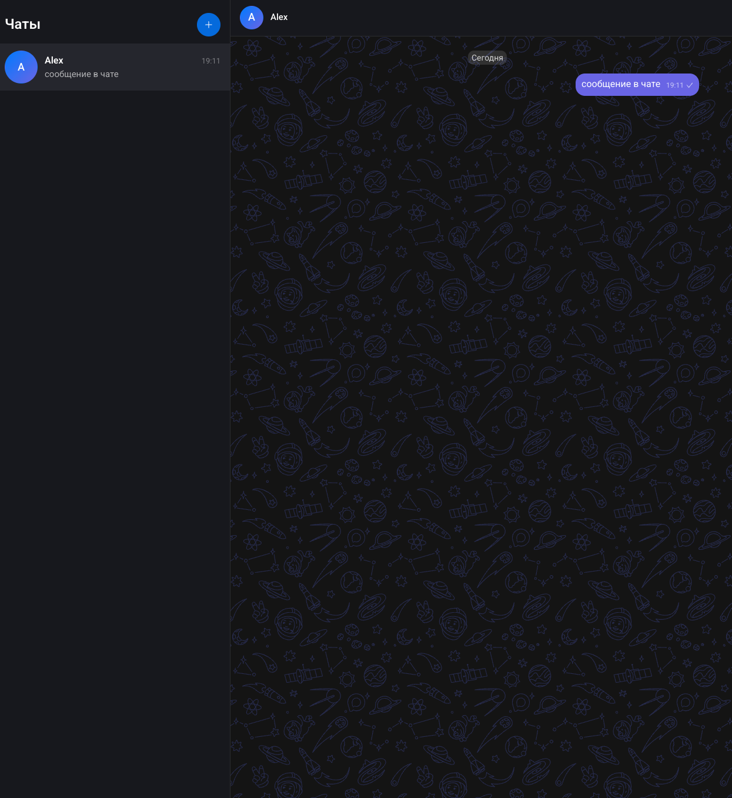
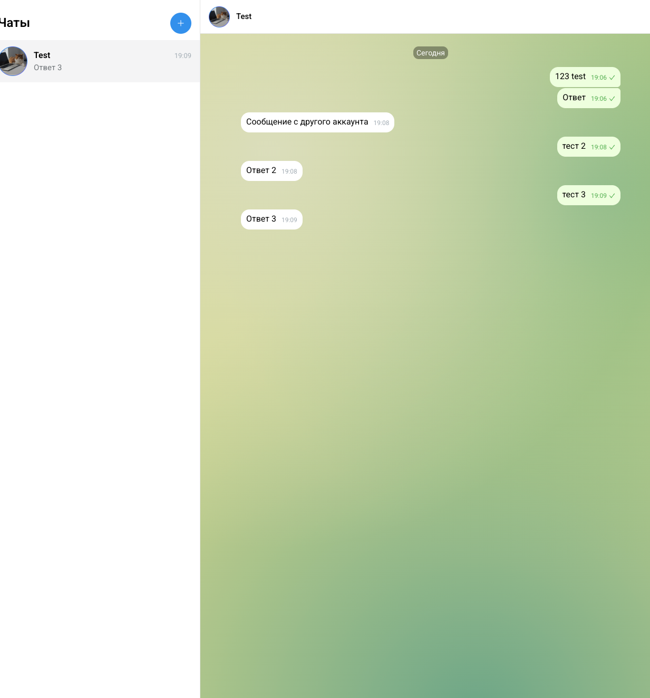
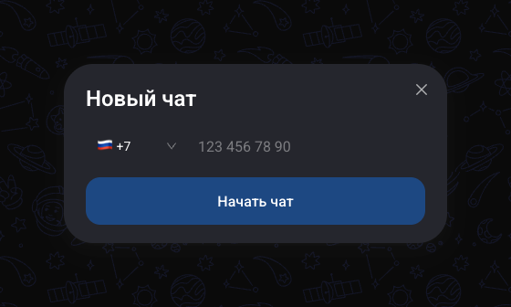

<p align="center">
	
</p>

<h1 align="center">NotiFire</h1>

<p align="center">
	<a href="https://github.com/AlexandraG-code/NotiFire/actions/workflows/deploy.yml"></a>
</p>

Веб-чат для отправки и получения текстовых сообщений через [GREEN-API](https://green-api.com). Оформление повторяет [web.max.ru](https://web.max.ru), есть второй скин в стиле Telegram.

## Возможности

- Вход по `idInstance` и `apiTokenInstance`; при входе выбирается мессенджер (MAX или Telegram), от него зависит оформление.
- Чат по номеру телефона: выбор страны, проверка номера.
- Отправка текста (`sendMessage`) со статусами и повторной отправкой, получение ответов (`receiveNotification` и `deleteNotification`).
- Имя, аватар и история чата подтягиваются при открытии (`getContactInfo`, `getChatHistory`).
- Предупреждение, если на инстансе выключены уведомления, и кнопка «Включить».
- Два скина (MAX и Telegram) и две темы (светлая и тёмная) — четыре варианта оформления. Скин выбирается при входе, тема переключается круговой анимацией в настройках или на странице входа.
- Адаптивная вёрстка: работает на десктопе и на телефоне.
- Локализация на русский и английский языки, язык выбирается по браузеру.

## Скриншоты

### Страница входа

Светлая и тёмная темы.

<p>
	
	
</p>

### Оформление

Скин выбирается при входе: слева MAX (тёмная тема), справа Telegram (светлая тема).

<p>
	
	
</p>

### Создание чата

Окно «Новый чат»: выбор страны с флагом и кодом, номер получателя; кнопка активна, только когда номер корректен для выбранной страны.

<p align="center">
	
</p>

## Запуск

Нужны Node.js 20.19+ и Yarn 1.22.

```bash
yarn install
cp env-config.ts.sample env-config.ts
yarn dev
```

Приложение откроется на http://localhost:5173. Сборка: `yarn build` (файл `env-config.ts` должен лежать до сборки), результат в `dist`.

`env-config.ts` — runtime-конфиг (`window._env_`), в git не попадает. Основные параметры:

| Параметр                 | По умолчанию                        | Описание                                             |
| ------------------------ | ----------------------------------- | ---------------------------------------------------- |
| `GREEN_API_URL_TEMPLATE` | `https://{shard}.api.green-api.com` | Адрес API, `{shard}` — первые 4 цифры инстанса       |
| `GREEN_API_CONSOLE_URL`  | `https://console.green-api.com`     | Консоль GREEN-API: ссылка в подсказке на форме входа |
| `API_TIMEOUT_MS`         | `15000`                             | Таймаут запросов, мс                                 |
| `HISTORY_MESSAGE_COUNT`  | `100`                               | Сколько сообщений истории подгружать                 |

Остальные параметры (интервалы опроса и повторов) с описаниями лежат в `env-config.ts.sample`.

## Как пользоваться

1. Выберите мессенджер, введите `idInstance` и `apiTokenInstance`, нажмите «Войти». Инстанс должен быть авторизован.
2. Нажмите «+», выберите страну, введите номер и начните чат.
3. Enter отправляет сообщение, Shift+Enter переносит строку. Ответ собеседника появится в этом же чате.
4. Тема, язык и выход находятся внизу списка чатов.

Чтобы ответы приходили, на инстансе должны быть включены уведомления (`incomingWebhook`, `outgoingMessageWebhook`, `outgoingAPIMessageWebhook`). Приложение проверит это само и покажет плашку с кнопкой «Включить»; настройки применяются в течение нескольких минут. То же можно сделать в [консоли GREEN-API](https://console.green-api.com).

## Тесты

| Команда     | Что делает                                                                                                       |
| ----------- | ---------------------------------------------------------------------------------------------------------------- |
| `yarn test` | Юнит- и компонентные тесты (Vitest, Testing Library): вход, создание чата, тема и скин, хранилища                |
| `yarn e2e`  | Сквозные тесты в браузере (Playwright): вход, чат по номеру, отправка сообщения, тема, язык, на настоящей сборке |

GREEN-API в тестах подменён, настоящий инстанс и токен не нужны. Перед первым запуском `yarn e2e` один раз установите браузер: `yarn playwright install chromium`.

Те же проверки (линтер, типы, юнит- и e2e-тесты) идут в GitHub Actions на каждый пуш и pull request: результат каждого теста виден на странице запуска во вкладке Actions, отчёт со скриншотами упавших тестов лежит в артефактах. Выкладка на Pages стартует, только если все проверки прошли.

## Деплой

Рабочая версия: **https://alexandrag-code.github.io/NotiFire/**. Для входа нужен свой инстанс GREEN-API (подсказка есть на форме входа).

Выкладка полностью автоматическая. Каждый пуш в `master` запускает GitHub Actions:

1. **Проверки** (`.github/workflows/ci.yml`): линтер, проверка типов, юнит-тесты (Vitest) и e2e-тесты (Playwright). Результат каждого теста виден на странице запуска во вкладке Actions, бейдж вверху README показывает статус последнего запуска.
2. **Публикация** (`.github/workflows/deploy.yml`): сборка и выкладка на GitHub Pages. Идёт только если все проверки прошли, поэтому сломанная версия на сайт не попадает.

Сайт статический, своего сервера у него нет, поэтому сборка рассчитана на размещение в любой папке хостинга:

- маршруты вида `#/chat/…` (на Pages нельзя настроить перенаправления для обычных адресов) и относительные пути к файлам;
- настройки (адрес API, интервалы опроса) лежат отдельным файлом `env-config.js` рядом с `index.html`: на своём хостинге их можно поменять без пересборки; значения по умолчанию в `env-config.ts.sample`;
- в страницу добавляется Content-Security-Policy: скрипты грузятся только со своего адреса, а запросы идут только на свой адрес и на API GREEN-API.

Чтобы выложить свою копию (форк), достаточно один раз включить Pages: Settings → Pages → Source: **GitHub Actions**. Репозиторий должен быть публичным.

## Структура

Проект построен по [Feature-Sliced Design](https://feature-sliced.design): слои `app → pages → widgets → features → entities → shared`, импорт идёт только вниз. Правила кода для разработчиков и агентов — в `AGENTS.md`.

## Данные и безопасность

- `apiTokenInstance` хранится в `sessionStorage` и исчезает при закрытии вкладки (приложению без своего сервера HttpOnly-куки недоступны).
- В собранной странице действует Content-Security-Policy: скрипты грузятся только со своего адреса, а запросы идут только на свой адрес и на API GREEN-API. Чужой скрипт не загрузится, а токен некуда отправить. Политика собирается в `vite/contentSecurityPolicy.ts`, адрес API берётся из `env-config.ts`.
- Чаты и сообщения лежат в `localStorage`, привязаны к `idInstance` и стираются при выходе. На общем компьютере выходите кнопкой «Выйти».

## Ограничения

- Только текстовые сообщения из личных чатов: медиа, группы и каналы игнорируются.
- Ответы приходят, пока приложение открыто (опрос идёт из вкладки). Что пришло при закрытом приложении, лежит в очереди GREEN-API недолго.
