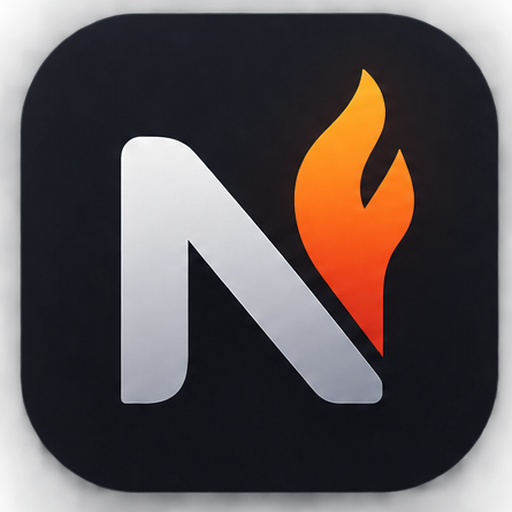

<p align="center">
	
</p>

<h1 align="center">NotiFire</h1>

Веб-чат для отправки и получения текстовых сообщений через [GREEN-API](https://green-api.com). Оформление повторяет [web.max.ru](https://web.max.ru), есть второй скин в стиле Telegram.

## Возможности

- Вход по `idInstance` и `apiTokenInstance`; при входе выбирается мессенджер (MAX или Telegram), от него зависит оформление.
- Чат по номеру телефона: выбор страны, проверка номера.
- Отправка текста (`sendMessage`) со статусами и повторной отправкой, получение ответов (`receiveNotification` и `deleteNotification`).
- Имя, аватар и история чата подтягиваются при открытии (`getContactInfo`, `getChatHistory`).
- Предупреждение, если на инстансе выключены уведомления, и кнопка «Включить».
- Два скина (MAX и Telegram) и две темы (светлая и тёмная) — четыре варианта оформления. Скин выбирается при входе, тема переключается круговой анимацией в настройках или на странице входа.
- Адаптивная вёрстка: работает на десктопе и на телефоне.
- Локализация на русский и английский языки, язык выбирается по браузеру.

## Скриншоты

Страница входа: светлая и тёмная темы.

<p>
	
	
</p>

## Запуск

Нужны Node.js 20.19+ и Yarn 1.22.

```bash
yarn install
cp env-config.ts.sample env-config.ts
yarn dev
```

Приложение откроется на http://localhost:5173. Сборка: `yarn build` (файл `env-config.ts` должен лежать до сборки), результат в `dist`.

`env-config.ts` — runtime-конфиг (`window._env_`), в git не попадает. Основные параметры:

| Параметр                 | По умолчанию                        | Описание                                       |
| ------------------------ | ----------------------------------- | ---------------------------------------------- |
| `GREEN_API_URL_TEMPLATE` | `https://{shard}.api.green-api.com` | Адрес API, `{shard}` — первые 4 цифры инстанса |
| `API_TIMEOUT_MS`         | `15000`                             | Таймаут запросов, мс                           |
| `HISTORY_MESSAGE_COUNT`  | `100`                               | Сколько сообщений истории подгружать           |

Остальные параметры (интервалы опроса и повторов) с описаниями лежат в `env-config.ts.sample`.

## Как пользоваться

1. Выберите мессенджер, введите `idInstance` и `apiTokenInstance`, нажмите «Войти». Инстанс должен быть авторизован.
2. Нажмите «+», выберите страну, введите номер и начните чат.
3. Enter отправляет сообщение, Shift+Enter переносит строку. Ответ собеседника появится в этом же чате.
4. Тема, язык и выход находятся внизу списка чатов.

Чтобы ответы приходили, на инстансе должны быть включены уведомления (`incomingWebhook`, `outgoingMessageWebhook`, `outgoingAPIMessageWebhook`). Приложение проверит это само и покажет плашку с кнопкой «Включить»; настройки применяются в течение нескольких минут. То же можно сделать в [консоли GREEN-API](https://console.green-api.com).

## Структура

Проект построен по [Feature-Sliced Design](https://feature-sliced.design): слои `app → pages → widgets → features → entities → shared`, импорт идёт только вниз. Правила кода для разработчиков и агентов — в `AGENTS.md`.

## Данные и безопасность

- `apiTokenInstance` хранится в `sessionStorage` и исчезает при закрытии вкладки (приложению без своего сервера HttpOnly-куки недоступны).
- Чаты и сообщения лежат в `localStorage`, привязаны к `idInstance` и стираются при выходе. На общем компьютере выходите кнопкой «Выйти».

## Ограничения

- Только текстовые сообщения из личных чатов: медиа, группы и каналы игнорируются.
- Ответы приходят, пока приложение открыто (опрос идёт из вкладки). Что пришло при закрытом приложении, лежит в очереди GREEN-API недолго.
